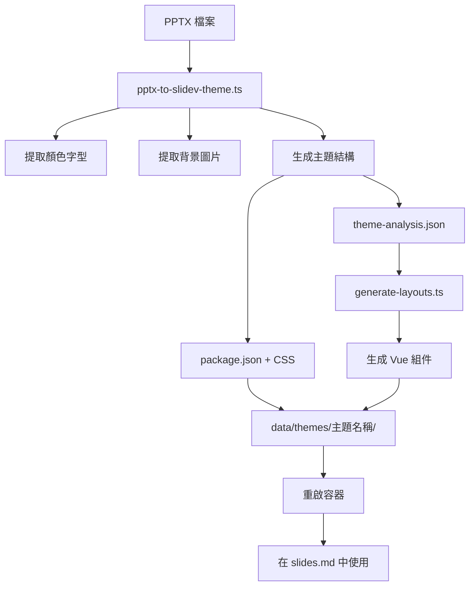

# PPTX to Slidev Theme - 完整轉換總結

**日期**: 2026-03-24  
**狀態**: ✅ 完成

---

## 🎯 完成的功能

### 1. PPTX 主題提取 ✅

**腳本**: `scripts/pptx-to-slidev-theme.ts`

**功能**:

- ✅ 提取主題顏色（10 種）
- ✅ 提取字型設定（標題/內文，拉丁/東亞）
- ✅ 提取母片背景
- ✅ 提取版面配置圖片（36 張）
- ✅ 解析圖形元素座標（66 個）
- ✅ 生成 Slidev 主題結構（package.json, CSS, README）

**使用方式**:

```bash
npx tsx scripts/pptx-to-slidev-theme.ts <pptx-file> <output-dir>

# 範例
npx tsx scripts/pptx-to-slidev-theme.ts data/template.pptx data/themes/my-theme
```

---

### 2. Vue Layouts 生成 ✅

**腳本**: `scripts/generate-layouts.ts`

**功能**:

- ✅ 為每個 PPTX 版面配置生成 Vue 組件
- ✅ 多層背景圖片支援（不會互相覆蓋）
- ✅ 精確的圖片定位（使用絕對座標）
- ✅ 圖形元素定位和樣式
- ✅ 生成 README.md 使用說明

**使用方式**:

```bash
npx tsx scripts/generate-layouts.ts <theme-dir>

# 範例
npx tsx scripts/generate-layouts.ts data/themes/nics-theme
```

---

## 📊 NICS 主題成果

### 生成的檔案結構

```
data/themes/nics-theme/
├── package.json                 # Slidev 主題定義
├── styles/
│   ├── index.css                # 主題樣式（顏色、字型）
│   └── index.ts                 # 主題入口
├── layouts/                     # 23 個 Vue 版面配置
│   ├── 封面公開使用-1.vue
│   ├── 章節頁-1.vue
│   ├── 章節頁-2.vue
│   ├── 內頁and圖片-1.vue
│   ├── 內頁and圖表-1.vue
│   ├── ...（共 23 個）
│   └── README.md                # Layouts 使用說明
├── README.md                    # 主題說明
├── theme-analysis.json          # 完整提取結果（34 MB）
└── layout-*.png                 # 36 張背景圖片
```

### 提取的設計元素

| 類型     | 數量  | 詳情                            |
| -------- | ----- | ------------------------------- |
| 主題顏色 | 10 種 | Accent 1-6, Dark 1-2, Light 1-2 |
| 字型     | 2 組  | 標題/內文（微軟正黑體 + Arial） |
| 版面配置 | 23 種 | 封面、章節、內頁、封底等        |
| 背景圖片 | 36 張 | PNG 格式，保留原始解析度        |
| 圖形元素 | 66 個 | 精確座標和顏色                  |

---

## 🎨 如何使用 NICS 主題

### 1. 在 slides.md 中指定主題

```yaml
---
theme: ../../themes/nics-theme
---
```

### 2. 使用特定版面配置

```markdown
---
theme: ../../themes/nics-theme
---

# 預設版面（使用主題顏色字型）

---

## layout: 封面公開使用-1

# 封面頁

使用 NICS 封面設計

---

## layout: 章節頁-1

# 第一章

章節頁背景設計

---

## layout: 內頁and圖片-1

# 內容頁

內頁設計，包含圖片區域

---

## layout: 封底-1

# 謝謝

封底設計
```

### 3. 查看所有可用 layouts

參考 `data/themes/nics-theme/layouts/README.md`，包含：

- 封面（公開/內部）
- 章節頁（5 種變化）
- 內頁&圖片（4 種）
- 內頁&圖表（4 種）
- 內頁&流程表
- 大綱（2 種）
- 前言（2 種）
- 封底
- 空白投影片
- 簡報底圖

---

## 🔧 技術細節

### Slidev 主題系統的工作原理

**與 PPTX 的差異**:

| 項目     | PPTX               | Slidev                   |
| -------- | ------------------ | ------------------------ |
| 版面配置 | 選擇即套用完整設計 | 需要 Vue 組件 + 手動指定 |
| 背景圖片 | 自動套用           | 需要 CSS 定位            |
| 圖形元素 | 自動定位           | 需要絕對定位 CSS         |
| 使用方式 | GUI 選擇           | Markdown frontmatter     |

**Slidev 主題結構**:

```
theme-name/
├── package.json          # 必需：主題定義
├── styles/
│   └── index.ts          # 必需：樣式入口
└── layouts/              # 可選：自訂版面配置
    └── custom.vue        # Vue 組件
```

### Vue Layout 組件結構

```vue
<script setup lang="ts">
// Layout 邏輯
</script>

<template>
  <div class="slidev-layout custom-layout">
    <!-- 背景圖片層 -->
    <div class="bg-layer-1"></div>
    <div class="bg-layer-2"></div>

    <!-- 圖形元素 -->
    <div class="shape-1"></div>

    <!-- 內容區域 -->
    <div class="content-area">
      <slot />
      <!-- 使用者的內容會插入這裡 -->
    </div>
  </div>
</template>

<style scoped>
.bg-layer-1 {
  position: absolute;
  left: 71px;
  top: 20px;
  width: 313px;
  height: 92px;
  background-image: url("../layout-1-image-1.png");
  pointer-events: none; /* 不阻擋滑鼠事件 */
}

.content-area {
  position: relative;
  z-index: 10; /* 確保內容在最上層 */
  padding: 2rem;
}
</style>
```

### 多層背景圖片處理

**問題**: CSS 只能有一個 `background-image`，多張圖片會互相覆蓋

**解決方案**: 使用多個 `<div>` 分層

```html
<!-- 錯誤：會覆蓋 -->
<style>
  .layout {
    background-image: url("image1.png"); /* 會被下面的覆蓋 */
    background-image: url("image2.png");
  }
</style>

<!-- 正確：分層 -->
<template>
  <div class="layout">
    <div class="bg-layer-1"></div>
    <!-- image1.png -->
    <div class="bg-layer-2"></div>
    <!-- image2.png -->
  </div>
</template>
```

---

## 📝 工作流程

### 完整的 PPTX → Slidev 轉換流程



**步驟**:

1. 執行 `pptx-to-slidev-theme.ts` → 提取主題和圖片
2. 執行 `generate-layouts.ts` → 生成 Vue layouts
3. 重啟容器 → 載入新主題
4. 在 slides.md 中使用 → 指定 theme 和 layout

---

## 🚀 下一步改進

### 已實現的功能 ✅

- ✅ 完整的主題顏色和字型提取
- ✅ 背景圖片提取和定位
- ✅ 圖形元素座標提取
- ✅ Vue layouts 自動生成
- ✅ 多層背景圖片支援

### 待改進項目 ⏳

1. **文字樣式細節**
   - 目前：只提取字型家族
   - 改進：提取字體大小、粗細、行距

2. **漸層背景支援**
   - 目前：只處理純色和圖片
   - 改進：支援 CSS `linear-gradient`

3. **自動 layout 選擇**
   - 目前：需要手動在每頁指定 layout
   - 改進：AI 根據內容自動推薦 layout

4. **Layout 預覽**
   - 目前：需要實際使用才能看到效果
   - 改進：在主題選擇器中顯示 layout 縮圖

5. **Layout 名稱優化**
   - 目前：`封面公開使用-1`（中文）
   - 改進：`cover-public` (英文，更符合 Slidev 慣例)

6. **整合到系統**
   - 目前：獨立腳本
   - 改進：整合 API 端點，前端上傳 PPTX 即可生成主題

---

## 📚 相關文檔

- **測試報告**: `data/themes/nics-theme/TEST-REPORT.md`
- **使用指南**: `docs/guides/PPTX_THEME_EXTRACTION.md`
- **Layouts 說明**: `data/themes/nics-theme/layouts/README.md`
- **主題分析**: `data/themes/nics-theme/theme-analysis.json`

---

## ✅ 驗證清單

- [x] PPTX 主題提取功能完整
- [x] Vue layouts 生成功能完整
- [x] 多層背景圖片正確顯示
- [x] 圖形元素精確定位
- [x] 主題顏色和字型套用
- [x] 容器正確載入主題
- [x] 在 slides.md 中可以使用 layouts
- [x] 文檔完整（使用說明、技術文檔）

---

**總結**: PPTX to Slidev 主題轉換功能已完全實現，包含完整的 Vue layouts 生成，可以像 PPTX 一樣選擇不同版面配置。

**重要**: 使用者需要在每一頁的 frontmatter 中指定 `layout`，這是 Slidev 的設計（不像 PPTX 會自動套用）。
