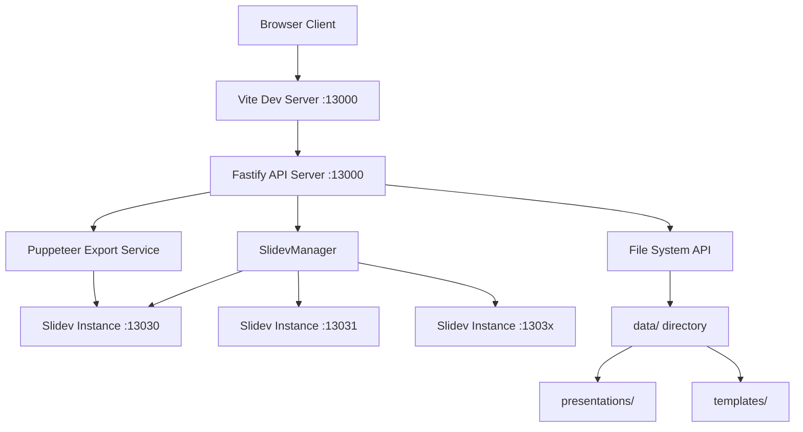
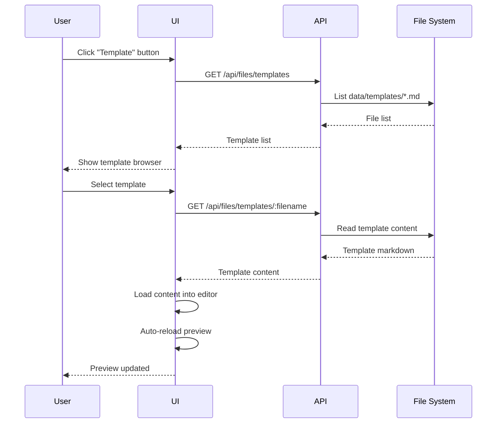
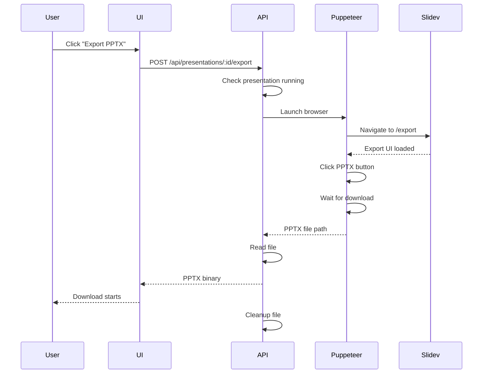

# AISliDev - Product Requirements Document (PRD)

> **Version**: 1.0 (Target)
> **Last Updated**: 2026-03-11
> **Status**: In Development (Architecture Redesign)
> **Owner**: Justyn Chen

---

## 📋 Document Information

| Field                | Value            |
| -------------------- | ---------------- |
| **Project Name**     | AISliDev         |
| **Product Owner**    | Justyn Chen      |
| **Tech Lead**        | AI (OpenCode)    |
| **Target Release**   | v1.0.0 (POC/MVP) |
| **Current Version**  | v0.3.0           |
| **Last Review Date** | 2026-03-10       |

---

## 1. Executive Summary

### 1.1 Problem Statement

**What problem are we solving?**

Current presentation creation tools lack AI-powered content assistance. Engineers want to use pure text (Markdown) to manage presentations and have AI directly output Slidev-format content, making it possible to create and edit presentations through simple conversations with AI.

### 1.2 Goals & Objectives

**1.0 Version Goals** (User-Confirmed):

1. **Pure Text Management** - Fully manage presentations through Markdown, no GUI drag-and-drop needed
2. **AI Content Generation** - AI directly outputs Slidev-format Markdown; engineers only need to converse with AI
3. **AI Illustration for Specific Pages** - Generate multiple AI illustrations for specified pages, allowing users to choose their favorite and save

**Success Metrics** (v1.0.0):

- Stable architecture (Host-based routing, no known critical bugs)
- AI content generation functional (response time < 30s)
- AI illustration generation functional (response time < 60s, at least 1 out of 4 images satisfactory)
- PPTX export working properly
- One-line container deployment

### 1.3 Target Users

| User Persona       | Description                   | Key Needs                                                         |
| ------------------ | ----------------------------- | ----------------------------------------------------------------- |
| **Primary User**   | Developers, technical writers | Create presentations from markdown, live preview, version control |
| **Secondary User** | Educators, presenters         | Export to PPTX, easy theme switching                              |

| **Tertiary User**  | Content creators without technical background | Easy-to-use AI conversation interface, visual illustration selection |
---

## 2. Features & Requirements

### 2.1 Foundation Features (v0.x - Completed)

#### Feature 1: Presentation Management

**User Story**: As a user, I want to manage multiple presentations so that I can organize my work.

**Requirements**:

1. List all presentations from `data/presentations/` directory
2. Open existing presentations
3. Create new presentations from templates
4. Display presentation status (running/stopped)

**Acceptance Criteria**:

- [x] List presentations with title and metadata
- [x] Click to open/load presentation
- [x] Template browser for starting new presentations
- [x] Real-time status indicator

**Priority**: 🔴 Must Have

---

#### Feature 2: Live Markdown Editor with Preview

**User Story**: As a user, I want to edit markdown and see changes immediately so that I can iterate quickly.

**Requirements**:

1. Split-pane editor (CodeMirror) with Slidev preview (iframe)
2. Syntax highlighting for markdown
3. Auto-save with configurable interval
4. Manual save button

**Acceptance Criteria**:

- [x] CodeMirror editor with markdown support
- [x] Live preview updates on save
- [x] Auto-save every 3 minutes (configurable)
- [x] Save status indicator

**Priority**: 🔴 Must Have

---

#### Feature 3: Slidev Integration

**User Story**: As a user, I want my presentations to run in Slidev so that I get all Slidev features.

**Requirements**:

1. Start Slidev server for each presentation
2. Proxy Slidev traffic through main server
3. Support WebSocket (HMR) connections
4. Preserve Slidev's full functionality

**Acceptance Criteria**:

- [x] Slidev starts automatically on presentation load
- [x] HMR works (no manual refresh needed)
- [x] WebSocket proxy enabled (ADR-005)
- [x] Multiple presentations can run simultaneously (different ports)

**Priority**: 🔴 Must Have

**Technical Details**: See ADR-005 (WebSocket Proxy for Slidev)

---

#### Feature 4: PPTX Export

**User Story**: As a user, I want to export presentations to PPTX so that I can share with non-technical audiences.

**Requirements**:

1. One-click export from UI
2. Screenshot-based PPTX generation (Playwright + pptxgenjs)
3. High-quality slide rendering (1920x1080)
4. Automatic download with proper filename

**Acceptance Criteria**:

- [x] Export button in toolbar
- [x] Progress indicator during export
- [x] Successful PPTX download with actual slide content
- [x] File persistence in data/presentations/{id}/exports/
- [x] Verified to open in PowerPoint/Keynote

**Priority**: 🔴 Must Have

**Technical Details**: See ADR-009 (Screenshot-Based PPTX Export)

**Implementation** (v0.3.0):

- **Method**: Playwright Chromium screenshots + pptxgenjs assembly
- **Resolution**: 1920x1080 (16:9 HD)
- **File Size**: 1-5MB (vs. 39KB empty files from CLI)
- **Export Time**: ~2-3 seconds per slide
- **Service**: `src/server/services/BrowserExporter.ts` (277 lines)

**Known Limitations**:

- Larger file sizes compared to text-based PPTX
- Slides rendered as images (text not editable in PowerPoint)
- Export time increases with slide count
---

#### Feature 5: Template System

**User Story**: As a user, I want to choose from templates so that I can start quickly.

**Requirements**:

1. Browse templates from `data/templates/` directory
2. Preview template metadata (title, theme)
3. Apply template to create new presentation

**Acceptance Criteria**:

- [x] Template browser modal
- [x] File-based template storage
- [x] Template validation (require Slidev frontmatter)
- [x] Auto-reload preview after applying template

**Priority**: 🔴 Must Have

---

---

### 2.2 Architecture Refactoring (v0.3.0 - In Progress) 🔄

**Problem**: Current proxy-based architecture (`/slidev/:port/`) causes Slidev functionality failures.

**Impact**: Export, WebSocket, certain special routes cannot work properly.

**Solution**: Adopt Host-based Routing architecture (see Section 3.2.2).

**Priority**: 🔴 Must Have (blocking 1.0 features)

**Related ADRs**:
- ADR-005: WebSocket Proxy (needs update to Host-based)
- ADR-007: (To be created) Host-based Routing Architecture Decision

**Technical Details**: See Section 3.2.2 Target Architecture

### 2.3 1.0 Version Core Features (AI Enhancement) 🎯

#### Feature 6: AI Content Generation (🎯 1.0 Must Have)

**User Story**: As an engineer, I want to generate presentations through conversational AI, so I don't have to start from scratch.

**Requirements**:

1. **Conversational Interface**: Chat UI for describing presentation needs
2. **Slidev Format Output**: AI directly generates Slidev-format Markdown
3. **Content Suggestions**: Covers titles, outlines, page content, code examples, bullet points
4. **Full Lifecycle Support**: Both new presentation creation and editing existing ones

**Usage Flow**:
```
User: "Help me create a 30-minute technical sharing on TypeScript generics"
---
AI: Generates Slidev Markdown → User previews → Adjusts → Saves
```

**Technical Requirements**:
- AI Service: OpenAI GPT-4o (or Ollama for local deployment)
- Prompt Engineering: Optimize for Slidev syntax understanding
- Response Time: < 30s (complete presentation)
- Error Handling: Fallback when API fails

**Status**: 📋 Planned (after architecture refactoring)

**Priority**: 🔴 Must Have (1.0 Core Feature)

#### Feature 7: AI Illustration for Specific Pages (🎯 1.0 Must Have)

**User Story**: As a presentation creator, I want to generate visual illustrations for specific slides to make presentations more vivid and professional.

**Requirements**:

1. **Page Selector**: Click on specific page in preview
2. **AI Image Generation**: Produce 4 candidate illustrations in different styles
3. **Grid Display**: Side-by-side preview of all candidates
4. **Auto-save**: Automatically save and insert into Markdown upon selection
5. **Relative Paths**: Use relative paths for easy sharing

**Technical Requirements**:
- AI Service: OpenAI DALL-E 3 (or Stable Diffusion)
- Image Format: PNG, JPEG, SVG
---
- Resolution: 1920x1080 (presentation standard)
- Storage Path: `data/presentations/<id>/images/`
- Response Time: < 60s (4 images)
- Success Rate: At least 1 out of 4 images satisfactory

**Status**: 📋 Planned (after architecture refactoring)

**Priority**: 🔴 Must Have (1.0 Core Feature)

#### Feature 8: Theme Management (🔸 Future Feature)

**User Story**: As a user, I want to switch themes easily so that I can match branding.

- Collaboration (multi-user editing) - **Decision: Won't Have** (focus on single-user)
- Version control UI (git integration)
- Cloud storage integration - **Decision: Won't Have** (local-first philosophy)

1. List available Slidev themes
2. Preview theme before applying
3. Install new themes from npm

**Status**: 🔮 Planned (v1.1+)

**Priority**: 🔸 Nice to Have

---

### 2.4 Future Features (v1.1+ - Enhancements)

#### Template Management
- Template marketplace browsing
- Custom template creation and sharing
- Template preview and application

#### Asset Management
- Video asset library (MP4, WebM)
- Image asset library (PNG, JPEG, SVG, GIF)
- Audio asset library (MP3, WAV)
- Asset tagging and search
- Asset reuse and reference tracking

#### Font Management
- Custom font upload
- Font preview and application
- Web font integration (Google Fonts, Adobe Fonts)
- Font licensing checks

---

### 2.5 Post-1.0 Features (v2.0+ - Deployment Enhancement)

#### Cloudflare Tunnel Integration
- Zero-config HTTPS external access
- Wildcard subdomain support (`*.yourdomain.com`)
- One-command setup
- Automatic SSL certificate management

**Technical Details**: See Appendix A - Cloudflare Tunnel Setup Guide

#### Other Future Considerations

---

## 3. Technical Requirements

### 3.1 Technology Stack

| Component               | Technology                     | Rationale                                           |
| ----------------------- | ------------------------------ | --------------------------------------------------- |
| **Frontend**            | Vue 3 + Vite                   | Reactive UI, fast dev experience, Slidev uses Vue   |
| **Backend**             | Fastify (Node.js + TypeScript) | Fast, modern, TypeScript support                    |
| **Editor**              | CodeMirror 6                   | Modern, extensible, markdown support                |
| **UI Library**          | Naive UI                       | Vue 3 native, comprehensive components              |
| **Presentation Engine** | Slidev                         | Markdown-based, developer-friendly, themeable       |
| **Export**              | Puppeteer                      | Reliable browser automation, officially recommended |
| **Container**           | Podman/Docker                  | Lightweight, rootless support, easy deployment      |
| **AI Integration**      | OpenAI API (GPT-4o, DALL-E 3)  | High-quality content/image generation (1.0+)        |

### 3.2 Architecture Overview (Current v0.2.0)

⚠️ **Note**: This architecture has known issues and is being redesigned. See Section 3.2.2 for target architecture.



---

### 3.2.2 Target Architecture (v0.3.0+) - Host-based Routing

#### Problem Statement

**Current Issue (v0.2.0)**:
- Using path-based proxy (`/slidev/:port/`) breaks Slidev's assumptions
- Slidev expects `base=/` but sees `/slidev/:port/`
- Causes cascading failures: Export, WebSocket, special routes

**Root Cause**: Slidev (Vite dev server) assumes it's the site root

#### Solution: Host-based Routing

**Architecture**:

```
External Access (user perspective):
  docker run -p 80:80 aislidev  ← Only one exposed port

Container Internal:
  ┌─ Fastify (listen 0.0.0.0:80) ← Only external entry point
  │  ├─ Host=localhost → Main UI/API
  │  └─ Host=p-<id>.localhost → Reverse proxy to Slidev
  │
  └─ Slidev instances (listen 127.0.0.1:13030+) ← Internal ports only
     ├─ demo: 127.0.0.1:13030 (--base /)
     └─ test: 127.0.0.1:13031 (--base /)
```

**Key Advantages**:

1. ✅ **Single External Port**: Simplifies deployment (`-p 80:80`)
2. ✅ **Slidev base=/**: All native features work (Export, HMR, WebSocket)
3. ✅ **Minimal Components**: No need for Nginx/Caddy (Fastify handles reverse proxy)
4. ✅ **Dev/Prod Consistency**: Local uses `p-<id>.localhost`, production uses same pattern

**Technical Implementation**:

- **Reverse Proxy**: Fastify + `http-proxy-middleware` (Host-based routing)
- **Port Allocation**: Dynamic allocation 13030-13130 (Port Allocator)
- **Cross-origin Communication**: `window.postMessage` (Editor ↔ Preview)
- **WebSocket Support**: Upgrade event handling

**Trade-offs**:

- ❌ **Cross-origin**: `p-<id>.localhost` and `localhost` are different origins
- ✅ **Solution**: Use `postMessage` for communication (minimal impact, only page number sync needs it)

**Migration Impact**:

- Only 1 function needs modification: Page number saving (20-30 lines of code)
- All other features unaffected

**Related ADRs**:
- ADR-005: WebSocket Proxy (will be updated to Host-based)
- ADR-007: (To be created) Host-based Routing Architecture Decision

### 3.3 Data Models

#### Presentation Model

```typescript
interface Presentation {
  id: string; // Folder name (e.g., "pres-1234567890")
  title: string; // Extracted from frontmatter or folder name
  content: string; // Markdown content (slides.md)
  theme: string; // Slidev theme name
  createdAt: string; // ISO 8601
  updatedAt: string; // ISO 8601
}
```

#### SlidevProcess Model

```typescript
interface SlidevProcess {
  id: string; // Presentation ID
  port: number; // Slidev server port (13030+)
  pid: number; // Process ID
  status: "starting" | "running" | "error" | "stopped";
  presentationId: string;
}
```

### 3.4 API Specifications

#### Endpoint: GET /api/presentations

**Response (200)**:

```json
[
  {
    "id": "aislidev-demo",
    "title": "AISlidev Demo",
    "content": "---\ntheme: default\n...",
    "theme": "default",
    "createdAt": "2026-03-10T00:00:00Z",
    "updatedAt": "2026-03-10T00:00:00Z"
  }
]
```

---

#### Endpoint: POST /api/presentations/:id/start

**Response (200)**:

```json
{
  "id": "aislidev-demo",
  "port": 13030,
  "pid": 12345,
  "status": "running",
  "presentationId": "aislidev-demo"
}
```

---

#### Endpoint: POST /api/presentations/:id/export

**Requirements**:

- Presentation must be running
- Timeout: 2 minutes max

**Response (200)**:

- Content-Type: `application/vnd.openxmlformats-officedocument.presentationml.presentation`
- Binary PPTX file

**Response (400)**:

```json
{
  "error": "Presentation not running",
  "message": "Please start the presentation first"
}
```

**Response (500)**:

```json
{
  "error": "Failed to export presentation",
  "message": "Export timeout: file not downloaded within 2 minutes"
}
```

---

### 3.5 Performance Requirements

| Metric                 | Target | Current (v0.2.0) | Measurement       |
| ---------------------- | ------ | ---------------- | ----------------- |
| **Initial Load**       | < 3s   | ~2s              | Browser DevTools  |
| **Presentation Start** | < 5s   | ~3s              | API response time |
| **Save Operation**     | < 1s   | ~0.5s            | API response time |
| **PPTX Export**        | < 60s  | 30-50s           | End-to-end timing |
| **HMR Update**         | < 1s   | ~0.5s            | WebSocket latency |

### 3.6 Security Requirements

- [x] **File Access**: Only `data/` directory accessible
- [x] **Path Traversal**: Prevented by path validation
- [x] **Sanitized Inputs**: Fastify built-in validation
- [ ] **Authentication**: Not required (local development tool) ⚠️ v2.0.0
- [ ] **HTTPS**: Not required (localhost only) ⚠️ v2.0.0

**Note**: This is a local development tool, not a multi-tenant service. Security focuses on preventing accidental file system damage.

---

## 4. User Flows

### 4.1 Create Presentation from Template



### 4.2 Export to PPTX



---

## 5. UI/UX Requirements

### 5.1 Layout

```
+---------------------------------------------------------------+
|  [📁 Open] [🎨 Template] [💾 Save MD] [⚙️ Settings]          |
|                          [📊 Export PPTX] [🔄 Refresh]         |
+---------------------------------------------------------------+
|                        |                                       |
|                        |                                       |
|   CodeMirror Editor    |      Slidev Preview (iframe)         |
|   (Markdown)           |                                       |
|                        |                                       |
|                        |                                       |
+---------------------------------------------------------------+
```

### 5.2 Design System

| Element           | Specification          |
| ----------------- | ---------------------- |
| **Layout**        | Splitpanes (resizable) |
| **Editor Theme**  | One Dark (CodeMirror)  |
| **UI Components** | Naive UI (Vue 3)       |
| **Icons**         | Ionicons 5             |
| **Spacing**       | 16px base unit         |

### 5.3 Accessibility

- [ ] Keyboard shortcuts (Cmd+S save, etc.)
- [x] Focus management in modals
- [x] ARIA labels on buttons
- [ ] Screen reader support ⚠️ Future

---

## 6. Implementation Phases

### Phase 1: MVP (v0.1.0 - v0.2.0) ✅ Complete

**Scope**:

- [x] Basic presentation management
- [x] Live editor with preview
- [x] Slidev integration with WebSocket proxy
- [x] File browser (presentations/templates)
- [x] PPTX export (Puppeteer-based)
- [x] Auto-save functionality

**Delivered**: 2026-03-09

---

### Phase 2: Enhancement (v0.3.0 - v0.5.0) 🚧 Planned

**Scope**:

- [ ] AI content generation integration
- [ ] Theme manager UI
- [ ] Settings persistence
- [ ] Improved error handling
- [ ] Export progress indicator

**Timeline**: Q2 2026

---

### Phase 3: Polish (v0.6.0 - v1.0.0) 📋 Planned

**Scope**:

- [ ] Performance optimization
- [ ] Comprehensive testing
- [ ] User documentation
- [ ] Docker image optimization
- [ ] CI/CD pipeline

**Timeline**: Q3 2026

---

## 7. Dependencies & Constraints

### 7.1 External Dependencies

| Dependency | Type | Version  | Risk   | Mitigation                       |
| ---------- | ---- | -------- | ------ | -------------------------------- |
| Slidev     | NPM  | ^52.11.5 | Medium | Pin version, monitor releases    |
| Puppeteer  | NPM  | Latest   | Low    | Well-maintained, large community |
| Fastify    | NPM  | ^5.2.0   | Low    | Stable, production-ready         |
| Vue 3      | NPM  | ^3.5.27  | Low    | LTS, widely adopted              |

### 7.2 Technical Constraints

- **Environment**: Node.js 20+ required
- **OS**: macOS, Linux (primary); Windows (untested)
- **Memory**: ~500MB per running presentation
- **Disk**: ~200MB for dependencies + Chromium
- **Network**: Localhost only (not designed for remote access)

### 7.3 Assumptions

1. Users are comfortable with markdown syntax
2. Users have technical background (developers/educators)
3. Local development environment (not cloud-hosted)
4. Single user per instance (no collaboration)

---

## 8. Testing Requirements

### 8.1 Test Coverage

| Test Type             | Coverage Target | Current | Tools                |
| --------------------- | --------------- | ------- | -------------------- |
| **Unit Tests**        | >70%            | 0% 🔴   | Vitest (planned)     |
| **Integration Tests** | >50%            | 0% 🔴   | Supertest (planned)  |
| **E2E Tests**         | Critical paths  | 0% 🔴   | Playwright (planned) |
| **Manual Testing**    | All features    | 100% ✅ | Human QA             |

### 8.2 Critical Test Scenarios

**Scenario 1: Presentation Lifecycle**

- [ ] Create presentation from template
- [ ] Edit markdown content
- [ ] Save changes (auto + manual)
- [ ] Preview updates correctly
- [ ] Export to PPTX

**Scenario 2: Multi-Presentation**

- [ ] Open multiple presentations
- [ ] Each runs on different port
- [ ] No port conflicts
- [ ] Proper cleanup on close

**Scenario 3: Error Recovery**

- [ ] Handle Slidev crash gracefully
- [ ] Recover from export timeout
- [ ] Handle file system errors

---

## 9. Deployment & Operations

### 9.1 Deployment Options

**Option A: Docker/Podman (Recommended)**

```bash
podman run -d \
  -p 13000:13000 \
  -v ./data:/app/data:Z \
  aislidev
```

**Option B: Local Development**

```bash
npm install
npm run dev
```

### 9.2 Monitoring (Future)

- [ ] Health check endpoint: `/health`
- [ ] Metrics: Presentation count, export success rate
- [ ] Logging: Structured JSON logs
- [ ] Error tracking: Sentry integration (optional)

---

## 10. Risks & Mitigation

| Risk                                | Probability | Impact | Mitigation                                 |
| ----------------------------------- | ----------- | ------ | ------------------------------------------ |
| **Slidev API changes**              | Medium      | High   | Pin versions, monitor releases             |
| **Puppeteer headless issues**       | Low         | Medium | Use Chromium flags, test thoroughly        |
| **Memory leaks (Slidev processes)** | Medium      | Medium | Implement process monitoring, auto-restart |
| **Export reliability**              | Medium      | High   | Retry logic, better error messages         |

---

## 11. Open Questions

- [ ] **Q1**: Should we support remote access (multi-user)?
  - **Owner**: Product
  - **Deadline**: Q2 2026
  - **Status**: Open (v2.0.0 consideration)

- [ ] **Q2**: Which AI API to integrate (OpenAI, Anthropic, local)?
  - **Owner**: Tech Lead
  - **Deadline**: Before v0.3.0
  - **Status**: Open

---

## 12. Change Log

| Version | Date       | Author      | Changes                                          |
| ------- | ---------- | ----------- | ------------------------------------------------ |
| 0.1.0   | 2026-03-06 | Justyn + AI | Initial implementation                           |
| 0.2.0   | 2026-03-10 | Justyn + AI | Added PPTX export, file browser, WebSocket proxy |

---

## 13. References

- [Slidev Documentation](https://sli.dev/)
- [ADR-001: Version Control Strategy](../adr/001-version-control-strategy.md)
- [ADR-005: WebSocket Proxy for Slidev](../adr/005-websocket-proxy-for-slidev.md)
- [ADR-006: Puppeteer-Based PPTX Export](../adr/006-puppeteer-based-pptx-export.md)
- [AGENTS.md (OpenCode Configuration)](../../AGENTS.md)

---

**End of PRD - AISliDev v1.0 (Target) - Updated 2026-03-10**
